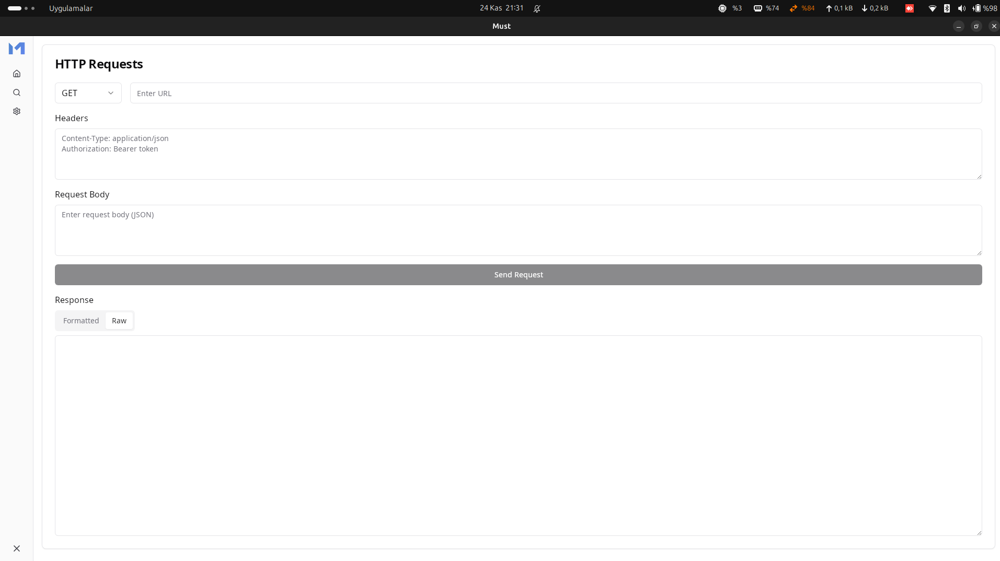

# MUST

A lightweight, cross-platform HTTP request client built with Tauri and React. This application provides a simple and efficient way to test API endpoints, similar to Postman but with a native feel and better performance.

## Features

- 🚀 Fast and lightweight native application
- 🔄 Support for common HTTP methods (GET, POST, PUT, DELETE)
- 📝 Custom header management
- 📦 Request body support
- 🎨 JSON response formatting
- 📑 Raw and formatted response viewing options
- 🎯 Simple and intuitive user interface

## Prerequisites

Before running this application, make sure you have the following installed:
- Node.js (v16 or higher)
- Rust (latest stable version)
- Tauri CLI
- pnpm/npm/yarn

## Installation

1. Clone the repository
```bash
git clone <your-repository-url>
cd http-request-client
```

2. Install dependencies
```bash
pnpm install
```

3. Run the development server
```bash
pnpm tauri dev
```

4. Build for production
```bash
pnpm tauri build
```

## Usage

1. Enter the request URL in the input field
2. Select the HTTP method (GET, POST, PUT, DELETE)
3. Add any required headers in the Headers section (one per line in the format `Key: Value`)
4. For POST/PUT requests, enter the request body in JSON format
5. Click "Send Request" to make the request
6. View the response in either formatted (for JSON responses) or raw format

## Project Structure

```
src/
  ├── App.jsx          # Main application component
  ├── components/      # UI components
  └── styles/         # CSS styles
src-tauri/
  └── src/
      └── main.rs     # Rust backend code
```

## Technologies Used

- [Tauri](https://tauri.app/) - Framework for building native applications
- [React](https://reactjs.org/) - Frontend framework
- [shadcn/ui](https://ui.shadcn.com/) - UI components
- [Tailwind CSS](https://tailwindcss.com/) - Styling

## Development

### Required Components

Make sure to install the required shadcn/ui components:

```bash
npx shadcn-ui@latest add card
npx shadcn-ui@latest add button
npx shadcn-ui@latest add input
npx shadcn-ui@latest add select
npx shadcn-ui@latest add textarea
npx shadcn-ui@latest add tabs
```

## Contributing

1. Fork the repository
2. Create your feature branch (`git checkout -b feature/amazing-feature`)
3. Commit your changes (`git commit -m 'Add some amazing feature'`)
4. Push to the branch (`git push origin feature/amazing-feature`)
5. Open a Pull Request

## License

This project is licensed under the MIT License - see the [LICENSE](LICENSE) file for details.

## Acknowledgments

- Inspired by Postman
- Built with Tauri's security and performance in mind
- Uses shadcn/ui's beautiful components